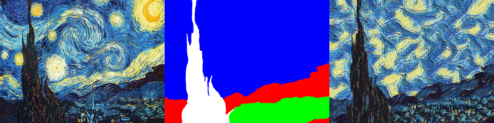

## Feed-forward neural doodle

This repository merges [fast-neural-doodle](https://github.com/DmitryUlyanov/fast-neural-doodle) and  and [Texture Networks](https://github.com/DmitryUlyanov/texture_nets). Read the [blog post (coming soon)](soon) for the details on the doodle algorithm and the [paper](http://arxiv.org/abs/1603.03417) to learn more about texture networks.

You can find an **online demo** at [likemo.net](http://likemo.net).

### Prerequisites
- torch
  - [torch-hdf5](torch-hdf5)
  - [torch.cudnn](https://github.com/soumith/cudnn.torch)
  - [display](https://github.com/szym/display)
- python
  - sklearn
  - skimage
  - numpy
  - scipy
  - h5py
  - joblib

A good guide on installation can be found [here](https://github.com/jcjohnson/neural-style/blob/master/INSTALL.md).  

You also need to download VGG-19 recognition network.
```
cd data/pretrained && bash download_models.sh && cd ../..
```

### Generate doodles for training

Use [diamond square](https://en.wikipedia.org/wiki/Diamond-square_algorithm) algorithm to produce a random doodle and store it in hdf5 database.
```
  python generate.py --n_jobs 30 --n_colors 4 --style_image data/starry/style.png --style_mask data/starry/style_mask.png --out_hdf5 data/starry/gen_doodles.hdf5
```

### Learn a network
Here is an example for `starry_night` used in the [demo](http://likemo.net/).
```
CUDA_VISIBLE_DEVICES=0 th feedforward_neural_doodle.lua -model_name skip_noise_4 -masks_hdf5 data/starry/gen_doodles.hdf5 -batch_size 4 -num_mask_noise_times 0 -num_noise_channels 0 -learning_rate 1e-1 -half false
```

All the parameters are explained in the code.

### Stylize the doodle

After the net is trained you can process any doodle with
```
python apply.py --colors data/starry/gen_doodles.hdf5colors.npy --target_mask data/starry/style_mask.png --model data/out/starry_night.t7
```

A pretrained `starry_night` net is there in `pretrained` folder. You can try it with
```
python apply.py --colors pretrained/gen_doodles.hdf5colors.npy --target_mask data/starry/style_mask.png --model pretrained/starry_night.t7
```

## Hardware
- The code was tested with 12GB NVIDIA Tesla K40m GPU and Ubuntu 14.04.

## Credits

The code is based on [Justin Johnson's code](https://github.com/jcjohnson/neural-style) for artistic style.

Uses [buckinha/DiamondSquare](https://github.com/buckinha/DiamondSquare) as is.
